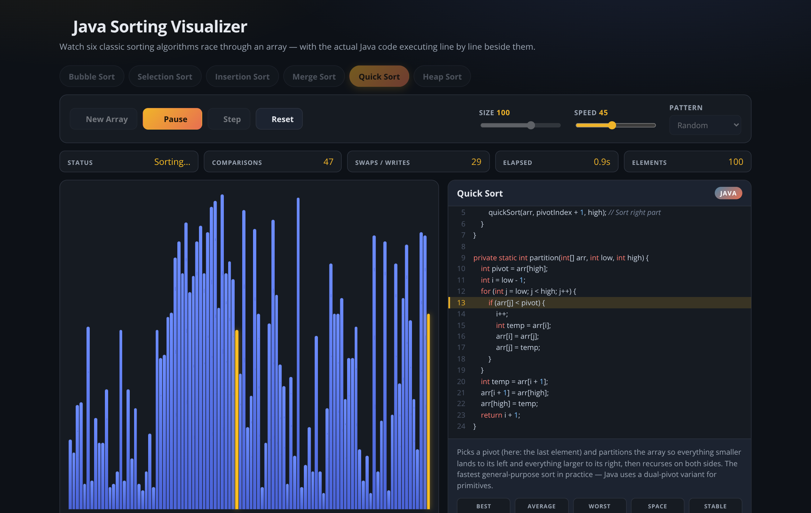

# ☕ Java Sorting Algorithm Visualizer

An interactive webpage that demonstrates six classic sorting algorithms — with the
**real Java code** executing line by line next to the animation.

 



## Features

- **Six algorithms**: Bubble, Selection, Insertion, Merge, Quick, and Heap Sort.
- **Live visualization**: color-coded bars show comparisons (amber), swaps/writes
  (red), pivots/keys (purple), and elements that reached their final position (green).
- **Java code panel**: the actual Java implementation is displayed with syntax
  highlighting, and the *exact line being executed lights up* as the sort runs.
- **Full playback control**: play/pause (or hit `Space`), single-step through the
  algorithm, adjustable speed, and reset to the original array.
- **Array scenarios**: random, nearly sorted, reversed, or few-unique values —
  great for seeing how each algorithm behaves on different inputs (try Insertion
  Sort on "Nearly sorted"!).
- **Stats & theory**: live comparison/swap/time counters plus a complexity card
  (best/average/worst, space, stability) and a plain-English explanation.

## Run the webpage

No build step, no dependencies — open `index.html` in any modern browser:

```bash
# either double-click index.html, or serve it:
python3 -m http.server 8000   # then visit http://localhost:8000/sorting-visualizer/
```

## Run the Java code

`SortingAlgorithms.java` contains the same implementations shown on the page,
plus a demo `main` that sorts a sample array with each algorithm and then races
all six on 20,000 random integers:

```bash
javac SortingAlgorithms.java && java SortingAlgorithms
```

## Run the tests

`test.js` verifies (headlessly, via Node) that every algorithm generator sorts
correctly across dozens of array shapes, and that every animation event points at
valid bars and valid Java source lines:

```bash
node test.js
```

## Files

| File                     | Purpose                                                            |
| ------------------------ | ------------------------------------------------------------------ |
| `index.html`             | Page layout                                                        |
| `styles.css`             | Dark theme, layout, bar & code-highlight styling                   |
| `algorithms.js`          | Shared core: Java snippets, metadata, and step-event generators    |
| `app.js`                 | UI controller: rendering, animation runner, controls               |
| `SortingAlgorithms.java` | Standalone runnable Java versions + demo/benchmark `main`          |
| `test.js`                | Headless correctness tests for the generators (`node test.js`)     |

## Algorithm cheat sheet

| Algorithm      | Best       | Average    | Worst      | Space      | Stable |
| -------------- | ---------- | ---------- | ---------- | ---------- | ------ |
| Bubble Sort    | O(n)       | O(n²)      | O(n²)      | O(1)       | Yes    |
| Selection Sort | O(n²)      | O(n²)      | O(n²)      | O(1)       | No     |
| Insertion Sort | O(n)       | O(n²)      | O(n²)      | O(1)       | Yes    |
| Merge Sort     | O(n log n) | O(n log n) | O(n log n) | O(n)       | Yes    |
| Quick Sort     | O(n log n) | O(n log n) | O(n²)      | O(log n)   | No     |
| Heap Sort      | O(n log n) | O(n log n) | O(n log n) | O(1)       | No     |
